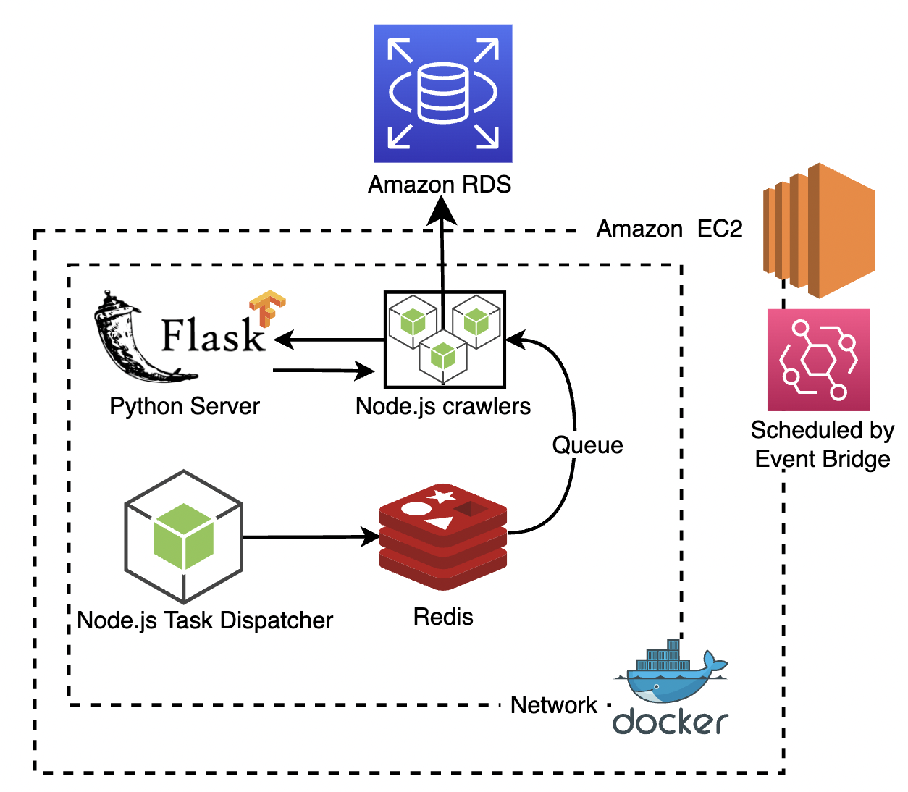

# Rsscat.net

https://www.rsscat.net

An RSS website with hundreds of sources gathers different topics of articles.
Also receiving Taiwan's top News from NewsAPI.
User can manage their tags and sources, to filter the articles.

# Test Accounts

|            | Email           | Password |
| ---------- | --------------- | -------- |
| account -1 | test01@mail.com | test01   |
| account -2 | test02@mail.com | test02   |

# Table of contents

-   [Feature](#Feature)
-   [Tech Stack](#TechStack)
-   [Architecture](#Architecture)
-   [Demo](#Demo)
    <!-- -   [TF-IDF](#TF-IDF) -->
    <!-- -   [Optimization](#Optimization) -->
    <!-- -   [License](#License) -->

# Features

-   Article auto-tagging.
-   Scheduled workers for scanning RSS new articles.
-   User's article source control.
-   User's tag management.
-   Pet cat with skin system.

# Tech Stack

**Client:**

    React, SASS

**Server:**

    Node.js, Express.js, Redis, Nginx, Docker

**Cloud Services:**

    EC2, RDS, CDN, S3

# Architecture

-   overview

    

-   AWS

    

-   worker

    

-   sql schema

    

# Demo

-   1. You can browse RSS articles and News.

     

-   2. Filter specific RSS article soruce.

     
     

-   3. New RSS source submit.

     

-   4. Recommend articles based on tags.

     

-   5. Click the like button to collect tags.

     

-   6. Customized recommended article tags.

     

-   7. Finish daily mission and get coins.

     

-   8. Interact with pet cat.

     

-   9. Buy and switch the cat's skin.

     
